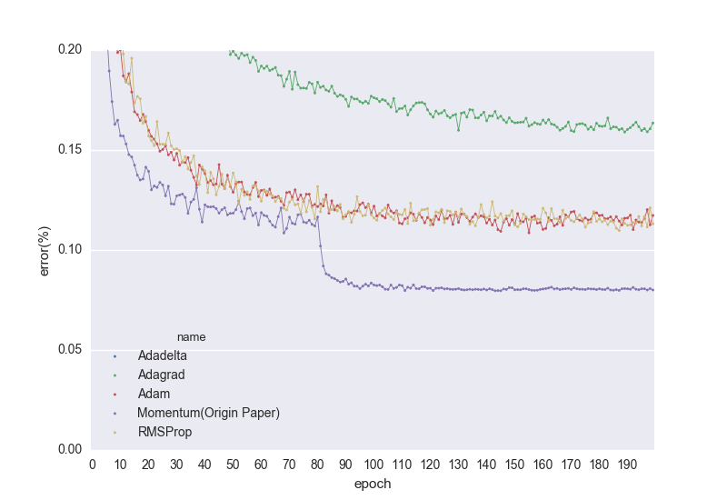

# CIFAR-10 via TensorFlow

## Install
```
sh install.sh
```

## Usage
network.pyにあるCifar10Classifier_XXXをtrain.pyの下の方に突っ込んで以下のコマンドを実行する．
```
# Residual Network(32 layers)を訓練させたい場合
python train.py --class_name Cifar10Classifier_ResNet32
```
output に数値計算結果が出力され，modelsにモデルが生成されます．


## Performance

| Name                    | Precision       | Memo                      |
|-------------------------|-----------------|---------------------------|
|Cifar10Classifier_01     | 83.11%          |                           |
|Cifar10Classifier_02     | 87.00%          |                           |
|Cifar10Classifier_03     | 87.25%          |                           |
|Cifar10Classifier_04     | 87.67%          |                           |
|Cifar10Classifier_05     | 87.17%          |                           |
|Cifar10Classifier_06     | 86.74%          |                           |
|Cifar10Classifier_ResNet20     | 91.07%          | [2]                 |
|Cifar10Classifier_ResNet32     | 92.04%          | [2]                 |
|Cifar10Classifier_ResNet44     | 91.93%          | [2]                 |
|Cifar10Classifier_ResNet56     | 92.38%          | [2]                 |
|Cifar10Classifier_ResNet110     | 92.94%          | [2]                 |

## Environment

| Name     | Description           |
|----------|-----------------------|
|GPU       | GeForce GTX TITAN X   |
|OS        | Ubuntu 16.04 LTS      |
|Library   | TensorFlow 0.8.0      |

## ResNet

### 層数でのテストデータの誤差(%)


1epochは訓練データ5万枚を一周学習させた回数

### 各種ソルバーでの誤差(%)



## References
- [1]. Ioffe, Sergey, and Christian Szegedy. "Batch normalization: Accelerating deep network training by reducing internal covariate shift." arXiv preprint arXiv:1502.03167 (2015).

Batch Normの仕組みについて記載

- [2]. He, Kaiming, et al. "Deep Residual Learning for Image Recognition." arXiv preprint arXiv:1512.03385 (2015).

ImageNet 2015優勝アルゴリズム.

- [3]. He, Kaiming, et al. "Delving deep into rectifiers: Surpassing human-level performance on imagenet classification." Proceedings of the IEEE International Conference on Computer Vision. 2015.

重みの初期化方法が載っている．

- [4]. He, Kaiming, et al. "Identity mappings in deep residual networks." arXiv preprint arXiv:1603.05027 (2016).

Residual Networkの解析が行われている．

- [?]. [Survey - Deep Residual Learning for Image Recognition](http://qiita.com/supersaiakujin/items/935bbc9610d0f87607e8), 2016/03/01

[2].のサーベイ

- [?]. [Survey - Identity Mappings in Deep Residual Networks](http://qiita.com/supersaiakujin/items/eaa0fe0460c470c28bd8), 2016/03/30

[4].のサーベイ

